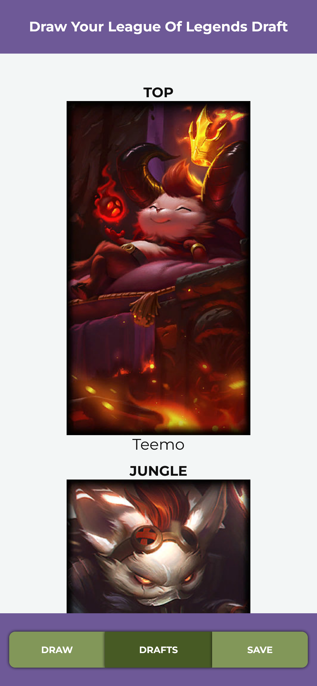
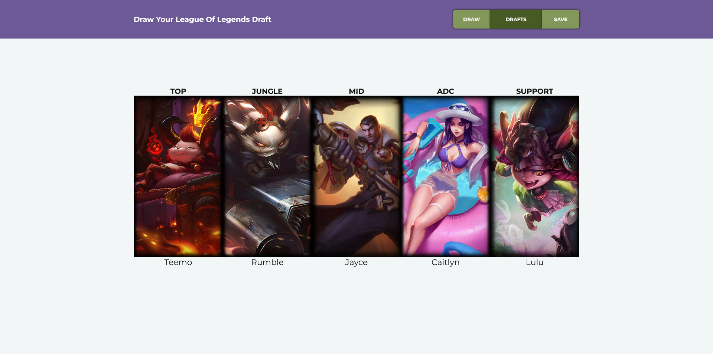

# Draw your League of Legends Draft

This is an simple application that lets you draw the League of Legends draft.

## Description

I play often with my friends in League of Legends. One day I came up with the idea of creating an app that that draws League of Legends drafts. I used [Data Dragon](https://developer.riotgames.com/docs/lol#data-dragon) data to download splash arts.

You can also save a selected draft to a browser local storage.

The application is adjusted to look good on smartphones as well as on desktops.

### Live Preview

Live Site URL: [Netlify](https://drawyourloldraft.netlify.app)

### Screenshots

## Technologies

The application is using the following technologies:

-   Build tool: Gulp.js
-   Frontend: HTML, Vanilla JavaScript (ES Modules), SCSS.

## Installation locally

1. Clone the repository: `git clone https://github.com/n3tr00x/lol-draft-app.git`
2. Navigate to the project directory: `cd lol-draft-app`
3. Install dependencies: `npm install`
4. Run the application: `npm start`

## Author

Hubert Warchoł - Project Creator
